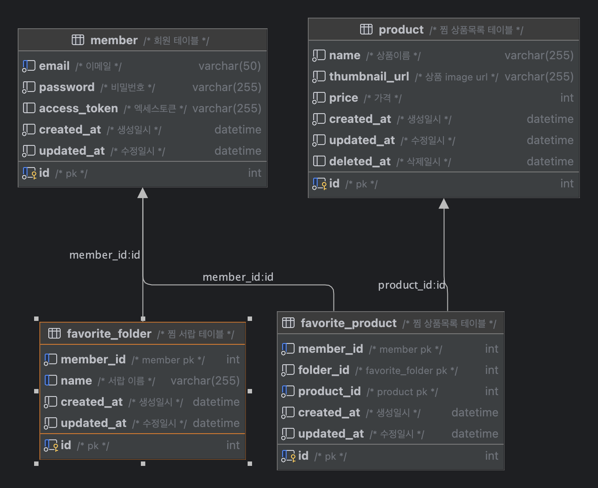

# favorite-folder

### API list ([swagger](http://localhost:8080/swagger-ui.html) 참고)
> 회원 가입, 로그인 API 외에는 모두 인증용 API로 구성 했으며, 테스트시 로그인 API 를 통해 발급받은 토큰을 헤더에 실고 통신합니다. (스웨거 ui Authorize 사용)
- 회원관리 
  - 회원 가입 API 
  - 로그인 API
  - 내 정보 조회 API
- 찜 서랍 관리
  - 찜 서랍 목록 조회
  - 찜 서랍 생성
  - 찜 서랍 상풍 목록 조회
  - 찜 서랍 삭제
- 찜 상품 관리
  - 찜 상품 등록
  - 찜 상품 삭제


### 개발환경

- Mac OS
- Java 11  
- Gradle 8.8
- Spring Boot 2.4.5
- Spring Boot Jpa
- Sping Security
- docker
- MySql 8.0.23

### 실행방법

- jar 생성

```shell
./gradlew bootJar
```

- 데이터베이스 및 프로젝트 서버 실행

```shell
docker-compose up
```


### 접속 정보

* 서버 URL: <http://localhost:8080/>
* 데이터베이스 URL: <http://localhost:3306/test>
* Swagger 명세 URL: <http://localhost:8080/swagger-ui.html>

### DB 계정 
```shell
username : root
password : root 
```
### ERD


